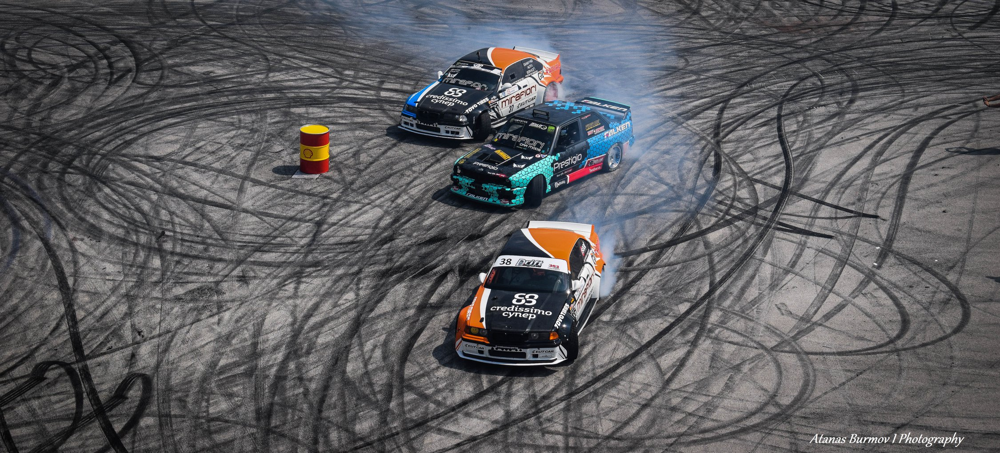

# Hi there, I'm Atanas - [乃ㄩ尺爪卂ㄒ卂][Channel] 👋

&nbsp;
## 👽 I'm Full Stack Developer
- 🔭 &nbsp; Currently studying - Computer Science
- 👯 &nbsp; Looking to collaborate with other content creators
- 🥅 &nbsp; Goals: Contribute more to Open Source projects
- 📫 &nbsp; You can contact me here: 

## 🎧Soundcloud
-  Click ⬇️                              

[][Scloud]

## 📷Photography
-  Click ⬇️      

[][Fpage]

## 📙Languages

  

---

  
📈 GitHub Stats

  
&nbsp;

  

[Channel]: https://www.youtube.com/channel/UCPraG3BkO7lavS1WjXHXwTQ
[Scloud]: https://soundcloud.com/gardian-since
[Fpage]: https://www.facebook.com/Aburmov